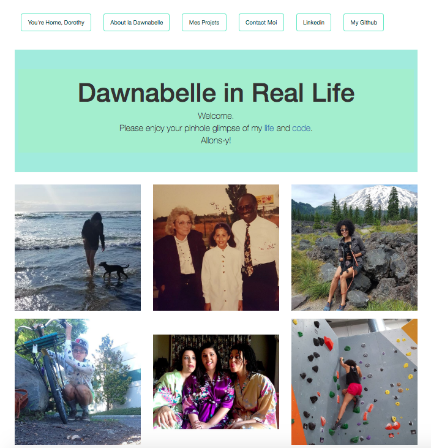
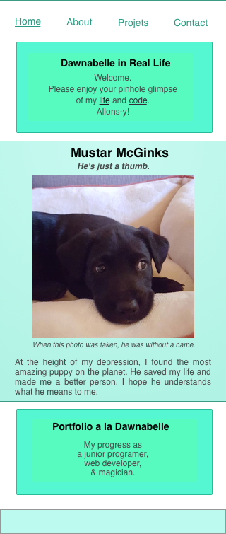

<!-- Twitter icon from https://github.com/carlsednaoui/gitsocial -->
[1.1]: http://i.imgur.com/tXSoThF.png (twitter icon with padding)

# _Portfolio_

#### **Dawn Mott** :sunrise_over_mountains: _June 15th, 2018_

## Description

_This app is an update of my  [Portfolio](https://beyonce.com) project from week one of Epicodus. Site built with Angular and flattery_

Mobile design in Sketch
 

## Setup/Installation Requirements

* _Install Angular CLI globally_
* _Clone this repository_
* _In a new tab, navigate to [this page](https://youtu.be/OSAOsm1u-OE)_
* _Return to previous task_
* _Run "npm install --style=scss" in CLI_
* _Run "ng build" in CLI_
* _Run "ng serve --open" in CLI_

## Known Bugs

_There are many known :bug: at this time, this is a work in progress_

## Support and contact details

_If you'd like to chat, please contact_ @dawnrparty _on_ ![alt text][1.1]

## Technologies Used

_HTML, SCSS, JavaScript, Angular, and flattery_

### License

*This page is licensed under the MIT license*

&copy; 2018 **Dawn Mott** :sunrise_over_mountains:
